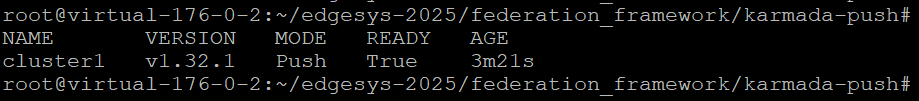

Edgesys-2025
===
## Evaluating the Performance of Kubernetes-Based Multi-Cluster Federation Frameworks in Real-world Large-Scale Deployments

### Abstract

This paper evaluates the performance of Kubernetes-based multicluster federation frameworks. We assess two such frameworks, Karmada and Open Cluster Management (OCM), in real-world large-scale environments and compare the push- and pull-based management models. The Grid’5000 testbed is used to deploy up to 200 clusters, simulating a real-world scenario. Experimental results indicate that the OCM pull-based management model achieves the most efficient resource utilization, making it more suitable for largescale deployments. In contrast, both pull- and push-based models in Karmada incur significantly higher network traffic and computing resource consumption when managing a large number of clusters.

### Packages:

#### Clusters Deployment
Deploy Kubernetes clusters on the **Grid'5000** large-scale and flexible testbed.

#### Federation Framework
Deploy Kubernetes-based multi-cluster federation frameworks, including **Karmada-Pull**, **Karmada-Push**, and **Open Cluster Management (OCM)**.

### Requirements & Information

- A **Grid'5000 account** is required to run the experiments. You can request an account [here](https://www.grid5000.fr/w/Grid5000:Get_an_account).

- The current script for deploying Kubernetes clusters runs on **Nantes ecotype servers**. You can modify the server set by editing the Python files in the folder. Find other available hardware [here](https://www.grid5000.fr/w/Hardware).

- This code uses **EnOSlib** for cluster deployment. Ensure that you have this Python package installed on the **Grid'5000 front-end**. More details can be found [here](https://discovery.gitlabpages.inria.fr/enoslib/tutorials/grid5000.html).

### How to use:

At the **Grid'5000 Nantes front-end**, download the package, navigate to the `clusters_deployment` folder and choose either **scenario1** or **scenario2**.

Then, execute the following script to automatically deploy Kubernetes clusters:

```bash
./01_deploy.sh
```

Deploying
<p align="center"></p>


Finish deployment of clusters
<p align="center"></p>


To delete all deployed Kubernetes clusters, run:

```bash
./04_del.sh
```


After the Kubernetes clusters are deployed, use **SSH** to connect to the management cluster. The IP address will be displayed on the screen. For example:

```bash
ssh root@10.176.0.2
```
Once connected to the management cluster, navigate to the Federation Framework folder and choose the framework you want to deploy.

For example, to deploy Karmada-Push, navigate to its directory:
```bash
cd edgesys-2025/Federation_Framework/Karmada-Push
```

<p align="center"></p>


Then, execute the scripts in the following order:

1. Deploy the related packages:
   ```bash
   ./00_deploy.sh
   ```
2. Set up Karmada-Push:
   ```bash
   ./01_karmada_push.sh
   ```
    <p align="center"></p>

    <p align="center"></p>
3. Verify the deployment
    ```bash
   ./02_check.sh
   ```

<p align="center"></p>

Based on the **scenario** you chose for cluster deployment, navigate to the corresponding folder to start collecting the related data.